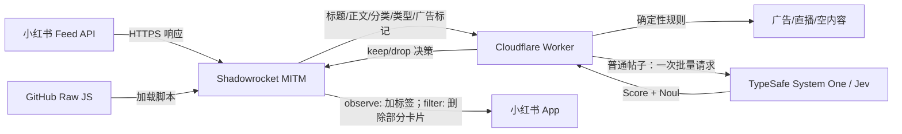
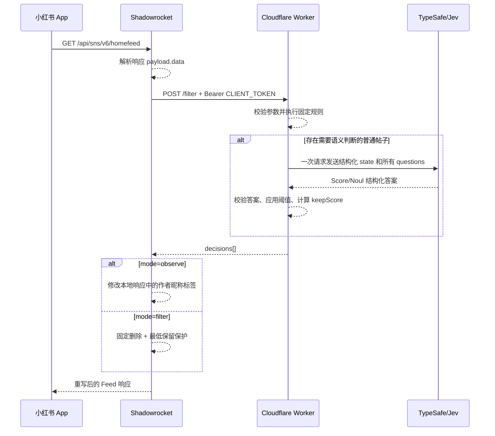

# 小红书 Feed Jev 过滤系统技术方案

> 文档类型：As-built（当前已实现方案）  
> 更新时间：2026-09-23  
> 策略版本：`5`
> TypeSafe 模型：`jev-1.13.0`

## 1. 背景与目标

本系统在 iOS 上通过 Shadowrocket 拦截小红书首页 Feed 响应，在响应返回给小红书客户端之前，对 Feed 卡片进行内容质量判断。

系统目标：

- 固定移除直播卡片和小红书明确标记的广告；
- 根据标题和 Feed 接口实际返回的正文判断普通帖子是否值得保留；
- 不使用作者身份参与判断；
- 支持先观察判定结果，再切换为真正过滤；
- TypeSafe、Worker 或网络异常时原样放行，避免首页不可用；
- TypeSafe API Key 只保存在服务端，不下发到手机。

非目标：

- 不修改小红书服务端推荐结果；
- 不分析封面图片、视频、语音或评论；
- 不逐帖调用详情接口补全正文；
- 不保证识别所有原生广告或软性营销；
- 不使用作者昵称、作者 ID 或账号历史判断内容。

## 2. 总体架构

系统由三个运行组件和一个代码分发渠道组成：

1. **Shadowrocket Module**：声明 HTTP Response Rewrite 规则和 MITM 域名。
2. **Shadowrocket JavaScript**：解析 Feed、构造最小请求、应用观察标签或删除结果。
3. **Cloudflare Worker**：鉴权、执行确定性规则、调用 TypeSafe/Jev、组合概率并返回决策。
4. **GitHub Raw**：托管公开 Module 模板和 Shadowrocket JavaScript，供客户端更新。



生产地址：

- Worker：`https://xhs-jev-filter.krisw.workers.dev`
- 过滤接口：`POST /filter`
- 健康检查：`GET /health`
- Module 模板：`https://raw.githubusercontent.com/weikx/shadowrocket-scripts/main/shadowrocket/xhs-feed-jev.module`
- 脚本：`https://raw.githubusercontent.com/weikx/shadowrocket-scripts/main/shadowrocket/xhs-feed-jev.js`

## 3. 请求处理时序



## 4. Shadowrocket 接入

### 4.1 拦截规则

Module 拦截：

```text
^https://rec\.xiaohongshu\.com/api/sns/v6/homefeed(?:\?|$)
```

配置要求：

- `type=http-response`；
- `requires-body=1`；
- MITM 域名包含 `rec.xiaohongshu.com`；
- iOS 已安装并完全信任 Shadowrocket CA 证书；
- Module 参数包含 Worker endpoint、`CLIENT_TOKEN` 和运行模式。

### 4.2 Module 参数

| 参数 | 默认值 | 含义 |
| --- | ---: | --- |
| `endpoint` | 空 | Worker `/filter` HTTPS 地址，必填 |
| `token` | 空 | Worker 客户端鉴权令牌，必填 |
| `mode` | `observe` | `observe` 或 `filter` |
| `timeoutMs` | `6000` | Shadowrocket 等待 Worker 的时间，限制为 1000～9000 ms |
| `minKeep` | `6` | 普通语义过滤后的最少保留条数 |
| `minKeepRatio` | `0.4` | 普通语义过滤后的最少保留比例 |

除精确字符串 `filter` 外，其他 `mode` 值都按 `observe` 处理，防止配置错误直接删帖。

## 5. Feed 数据提取

### 5.1 标题

按顺序选择第一个非空字符串：

1. 直播卡片的 `live.name`；
2. `title`、`display_title`、`name`；
3. `note.title`、`note.display_title`；
4. `note_card.title`、`note_card.display_title`；
5. `note_info.title`、`note_info.display_title`。

标题最多发送 300 个字符。

### 5.2 正文

按顺序选择第一个非空字符串：

1. `desc`、`content`、`description`；
2. `note.desc`、`note.content`、`note.description`；
3. `note_card.desc`、`note_card.content`、`note_card.description`；
4. `note_info.desc`、`note_info.content`、`note_info.description`。

正文最多发送 600 个字符。如果正文与原始标题完全相同，则正文置空，避免重复 token。

当前抓取样例中的普通帖子 `desc` 均为空，因此“支持正文”不代表每次首页请求都能获得正文。Feed 没有下发正文时，系统只能基于标题判断。

### 5.3 发送给 Worker 的字段

```json
{
  "schemaVersion": 1,
  "items": [
    {
      "key": "0",
      "title": "排查 Node.js 内存泄漏的三个步骤",
      "content": "采集堆快照、比较对象增长，并在修复后重复压测。",
      "category": "科技",
      "contentType": "normal",
      "isAds": false
    }
  ]
}
```

不会发送：

- 作者昵称和作者 ID；
- Cookie、请求头、Session、IDFA 和定位；
- 小红书帖子 ID；
- 图片、视频及其 URL；
- 推荐追踪字段；
- 原始 Feed 响应。

注意：标题和正文自身仍可能包含个人信息，它们会经过 Cloudflare Worker 并发送给 TypeSafe。

## 6. Worker API

### 6.1 `GET /health`

用途：检查 Worker 是否运行以及必需 Secret 是否存在。

示例响应：

```json
{
  "ok": true,
  "model": "jev-1.13.0",
  "configured": true
}
```

该接口不校验 TypeSafe Key 或客户端令牌是否正确，只检查二者是否已配置。

### 6.2 `POST /filter`

请求必须包含：

```http
Authorization: Bearer <CLIENT_TOKEN>
Content-Type: application/json
```

约束：

- 每次最多 30 个项目；
- `key` 必须唯一；
- 标题限制 300 字符；
- 正文限制 600 字符；
- 分类限制 100 字符；
- 内容类型限制 30 字符；
- 不合法请求返回 `400`；
- 客户端令牌不匹配返回 `401`。

响应示例：

```json
{
  "decisions": [
    {
      "key": "0",
      "action": "keep",
      "evaluation": "jev",
      "keepScore": 0.806,
      "contentValue": 0.74,
      "contentValueConfidence": 0.77,
      "signals": {
        "commercial": 0.02,
        "conflictBait": 0.05,
        "polarization": 0.01,
        "emotionalVenting": 0.04,
        "negativeNoise": 0.03,
        "engagementBait": 0.08
      },
      "preserveSignals": {
        "experienceSharing": 0.86,
        "lifestyleSharing": 0.12,
        "photographySharing": 0.03
      },
      "blocked": 0,
      "reasonCodes": [],
      "keepReasonCodes": ["EXPERIENCE_SHARING"]
    }
  ],
  "model": "jev-1.13.0",
  "policyVersion": "5",
  "durationMs": 719,
  "usage": {
    "input_tokens": 1047,
    "output_tokens": 57
  }
}
```

## 7. 判定流程

### 7.1 第一层：确定性规则

Worker 先在代码中处理不需要 AI 的情况：

| 条件 | action | reasonCode | 是否进入 Jev |
| --- | --- | --- | --- |
| `isAds === true` 且启用广告过滤 | `drop` | `AD_FLAG` | 否 |
| `contentType === "live"` | `drop` | `LIVE_CARD` | 否 |
| 标题和正文同时为空 | `drop` | `NO_CONTENT` | 否 |
| 其他情况 | 待判断 | — | 是 |

标题为空但正文存在时不会命中 `NO_CONTENT`，会正常进入 Jev。

### 7.2 第二层：TypeSafe/Jev 语义判断

所有待判断帖子被放入同一个结构化 `state.posts` 数组。`state` 还包含：

- 语言说明；
- 证据边界；
- 过滤目标；
- 高价值内容定义；
- 可选屏蔽主题。

当前实现只判断帖子内容，不生成兴趣匹配问题，也不向 Jev 提供作者昵称或作者身份。`blockedTopics` 配置非空时才会生成屏蔽主题问题。

每个帖子生成相互独立的问题：

| 问题 | 类型 | 输出 | 用途 |
| --- | --- | --- | --- |
| `content_value_N` | Score，4 级 | `score` + `confidence` | 衡量具体信息或实用价值 |
| `commercial_N` | Noul | `noul` | 判断主要目的是否为销售、推广或引流 |
| `conflict_bait_N` | Noul | `noul` | 判断是否主要通过挑衅、羞辱或激怒他人来引战 |
| `polarization_N` | Noul | `noul` | 判断是否用刻板印象、群体归罪或敌我叙事制造对立 |
| `emotional_venting_N` | Noul | `noul` | 判断是否主要是缺少背景和反思的情绪宣泄 |
| `negative_noise_N` | Noul | `noul` | 判断是否只放大恐惧、愤怒或绝望而缺少事实和建议 |
| `engagement_bait_N` | Noul | `noul` | 判断是否以信息缺失的噱头、悬念或互动请求骗取参与 |
| `experience_sharing_N` | Noul | `noul` | 判断是否为真实经历、过程、结果、测评、教训或个人叙述 |
| `lifestyle_sharing_N` | Noul | `noul` | 判断是否为真实的日常生活或个人审美分享 |
| `photography_sharing_N` | Noul | `noul` | 判断摄影或视觉创作本身是否为内容主体 |
| `blocked_N` | Noul | `noul` | 配置了屏蔽主题时判断是否命中 |

这些问题在一次 TypeSafe 请求中并行计算。Jev 只能看到显式提供的文本字段，提示中要求它：

- 综合标题和正文，允许任意一个为空；
- 不因为标题为空而处罚正文有价值的帖子；
- 不推断作者身份；
- 不推断没有提供的图片、视频或其他信息。

### 7.3 Score 与 Noul 的解释

内容价值 Score 使用四级标准：

| 原始等级 | 归一化值 | 含义 |
| ---: | ---: | --- |
| 0 | 0 | 没有可用信息：实质为空、模糊、纯情绪、口号、悬念或无上下文分享 |
| 1 | 约 0.33 | 提到了话题、观点或经历，但缺少具体背景、证据、解释或可复用结论 |
| 2 | 约 0.67 | 至少提供一项具体事实、解释、对比、方法、建议或一手经验 |
| 3 | 1 | 提供多项事实、步骤、数据、有依据的分析或特别有用的一手经验 |

Jev 返回的 Score 可以落在相邻等级之间。Worker 用 `score / 3` 归一化为 `0～1`，并保留 Score 的 `confidence`。

Noul 是“答案为是”的概率：

- 接近 `1`：强烈支持“是”；
- 接近 `0`：强烈支持“否”；
- 接近 `0.5`：是与否接近。

Noul 没有独立的 `confidence` 字段，代码不会为它构造伪 confidence。

### 7.4 第三层：阈值组合

当前默认阈值：

```json
{
  "blockedTopic": 0.8,
  "commercial": 0.75,
  "conflictBait": 0.7,
  "polarization": 0.7,
  "emotionalVenting": 0.8,
  "negativeNoise": 0.8,
  "engagementBait": 0.75,
  "experienceSharing": 0.55,
  "lifestyleSharing": 0.6,
  "photographySharing": 0.6,
  "maxContentValueForDrop": 0.45,
  "minContentValueConfidence": 0.4
}
```

先计算三个保留信号：

- `experienceSharing >= 0.55`：真实经验分享；
- `lifestyleSharing >= 0.60`：真实生活分享；
- `photographySharing >= 0.60`：摄影或视觉创作分享。

任意一项成立，帖子获得保留保护。然后执行下列规则：

1. `blocked >= 0.80`，原因 `BLOCKED_TOPIC`；
2. `commercial >= 0.75`，原因 `COMMERCIAL`；
3. `conflictBait >= 0.70`，原因 `CONFLICT_BAIT`；
4. `polarization >= 0.70`，原因 `POLARIZATION`；
5. 没有保留保护，且 `contentValue <= 0.45`、`contentValueConfidence >= 0.40`，原因 `LOW_INFORMATION_VALUE`；
6. 没有保留保护、满足低信息价值，且 `emotionalVenting >= 0.80`，追加原因 `EMOTIONAL_VENTING`；
7. 没有保留保护、满足低信息价值，且 `negativeNoise >= 0.80`，追加原因 `NEGATIVE_NOISE`；
8. 没有保留保护、满足低信息价值，且 `engagementBait >= 0.75`，追加原因 `ENGAGEMENT_BAIT`。

其中第 2～4 条是硬语义规则：高概率营销、引战或群体对立即使同时属于生活、摄影或经验分享，也会过滤。第 5～8 条是软语义规则，会被三个正向保留信号覆盖。内容主题负面或语气激烈，并不自动等于垃圾；灾害预警、诈骗分析、疾病科普、风险分析等帖子，如果提供了足够事实、解释或行动建议，也不会仅因“负面”而过滤。

没有任何原因码时得到 `keep`。当前默认 `blockedTopics=[]`，因此未配置自定义策略时不会生成 `blocked_N` 问题。一个帖子可同时命中多个原因码，这正是使用多个独立 Noul 而不是互斥分类的目的。

### 7.5 综合保留分

Worker 还会计算：

```text
keepScore = clamp(
  contentValue × 0.70
  + (1 - strongestRisk) × 0.30,
  0,
  1
)
```

`strongestRisk` 是屏蔽主题和六个语义信号中的最大值。`keepScore` 不直接决定 Worker 的 `keep/drop`；它只在客户端触发最低保留保护时，用于从多个语义 `drop` 中优先删除“信息价值更低且风险更强”的项目。

## 8. 客户端结果应用

### 8.1 观察模式

`mode=observe` 不删除任何 Feed 项目，只在手机本地修改昵称显示：

```text
[❌应移除] 原作者
[✅应保留] 原作者
[移除原因：负面噪音、信息价值低] 原标题
```

昵称只用于呈现观察结果，不会发送给 Worker 或 Jev。应移除帖子的标题会附加由 `reasonCodes` 翻译得到的中文原因；保留帖子的标题保持不变。

### 8.2 过滤模式

`mode=filter` 分两类处理：

1. `AD_FLAG` 和 `LIVE_CARD`：固定删除，不受最低保留机制影响；
2. 其他 Worker `drop`：按照 `keepScore` 从低到高删除，并受最低保留机制保护。

最低保留数：

```text
minimum = max(
  min(minKeep, Feed 总数),
  ceil(Feed 总数 × minKeepRatio)
)
```

默认参数下：

| 原始 Feed 数量 | 普通内容最低保留目标 |
| ---: | ---: |
| 5 | 5 |
| 10 | 6 |
| 15 | 6 |
| 20 | 8 |
| 30 | 12 |

广告和直播先固定删除，因此它们较多时，最终数量允许低于上表目标。`NO_CONTENT` 和各类 Jev 语义原因等其他 `drop` 仍受最低保留保护。

这意味着观察模式中的 `[❌应移除]` 是 Worker 的语义建议，不保证在过滤模式下全部真正删除；固定广告和直播除外。

## 9. TypeSafe 集成设计依据

当前方案遵循 TypeSafe System One 的推荐模式：

- **代码控制工作流**：拦截、鉴权、固定规则、阈值、排序和删除都由普通代码完成；
- **结构化 state**：标题、正文、分类、内容类型和策略分别使用命名字段；
- **原子问题**：内容价值、六个过滤信号和三个保留信号分别判断，避免一个模糊的“低质量”问题承担所有含义；
- **一次并行请求**：同页全部独立问题一次提交，避免逐帖串行调用；
- **正确使用 primitive**：程度使用 Score，是否成立使用 Noul；
- **显式处理不确定性**：低内容价值规则同时检查 Score confidence；
- **严格验证响应**：缺少答案、类型错误或数值无效时整次请求失败，不用默认值伪造结果；
- **版本固定**：使用 `jev-1.13.0`，避免 `jev-latest` 更新后让阈值行为无提示漂移。

TypeSafe 当前说明 CJK 文本受支持，但准确率低于主要训练语言英语，因此必须通过观察模式积累真实样本并继续调节阈值。结构化输出保证接口形状，不保证语义判断永远正确。

## 10. 超时、重试与失败策略

### 10.1 Worker → TypeSafe

- TypeSafe fetch 共享同一个 AbortController 截止时间，默认 `4500 ms`；
- 收到 `429` 或 `529` 时最多重试两次，即总计最多三次请求；
- 优先读取数字秒格式的 `Retry-After`，单次等待上限 1000 ms；
- 没有有效 `Retry-After` 时使用 200 ms、400 ms 指数退避；
- 非 `2xx`、响应缺少 `answers`、答案类型或数值错误均返回 Worker `502 filter_failed`。

重试等待本身不是可中断 sleep，因此 Worker 的实际墙钟耗时可能略超过 4500 ms；手机端仍有独立的 6000 ms 总等待保护。

### 10.2 Shadowrocket → Worker

- 默认等待 `6000 ms`；
- endpoint 缺失、token 缺失、响应体异常、Worker 非 `2xx`、超时、网络失败或结果无法解析时，调用 `$done({})`；
- `$done({})` 表示不提交改写后的 body，让原始 Feed 响应继续返回给小红书。

整体策略是 **fail open**：过滤系统异常时保留内容和可用性，不因错误把首页清空。

## 11. 安全与隐私

### 11.1 密钥分层

| 凭证 | 保存位置 | 用途 |
| --- | --- | --- |
| `TYPESAFE_API_KEY` | Cloudflare Worker Secret | Worker 调用 TypeSafe |
| `CLIENT_TOKEN` | Cloudflare Worker Secret + 用户个人 Module | Shadowrocket 调用 Worker |
| `FILTER_POLICY_JSON` | 可选 Worker Secret | 覆盖默认个人策略 |

`TYPESAFE_API_KEY` 不出现在 JavaScript、公开 Module、GitHub 或手机配置中。个人 Module 已被 Git 忽略，不进入公开仓库。

### 11.2 信任边界

- Shadowrocket 能看到被 MITM 的小红书 Feed 响应；
- Cloudflare Worker 能看到精简后的标题、正文和元数据；
- TypeSafe 能看到用于语义判断的结构化 state 和问题；
- GitHub 只托管公开代码和占位符配置；
- 小红书 App 最终只看到 Shadowrocket 改写后的响应。

### 11.3 风险

- iOS 上安装并信任用户 CA 会扩大本机 HTTPS 解密能力，应只使用可信配置；
- `CLIENT_TOKEN` 位于手机 Module 中，泄露后他人可能调用 Worker 消耗 TypeSafe 额度；
- Feed 结构变化可能导致正文或昵称字段无法命中；
- 标题或正文可能包含敏感文本，即使作者字段未上传；
- 本方案使用客户端响应改写，可能受 App 更新、证书绑定或平台规则影响。

## 12. 配置与部署

Worker 配置：

```json
{
  "name": "xhs-jev-filter",
  "compatibility_date": "2026-09-22",
  "workers_dev": true,
  "vars": {
    "TYPESAFE_MODEL": "jev-1.13.0",
    "TYPESAFE_TIMEOUT_MS": "4500"
  }
}
```

部署命令：

```bash
npm install
npx wrangler login
npx wrangler secret put TYPESAFE_API_KEY --config worker/wrangler.jsonc
npx wrangler secret put CLIENT_TOKEN --config worker/wrangler.jsonc
npm run worker:deploy
```

可选策略覆盖：

```bash
cp worker/policy.example.json worker/policy.local.json
npx wrangler secret put FILTER_POLICY_JSON \
  --config worker/wrangler.jsonc < worker/policy.local.json
```

策略覆盖继续兼容旧字段 `relevance` / `contentValue` 和 `relevanceConfidence` / `contentValueConfidence`，分别映射为 `maxContentValueForDrop` 和 `minContentValueConfidence`。旧 `filterCommercial: false` 也会映射为关闭 `enabledSignals.commercial`。其余旧版 `lowQuality` 阈值不再参与版本 5 判断。

请求中的 `schemaVersion: 1` 当前由客户端携带，但 Worker 尚未据此做版本分流或拒绝不兼容版本；这是后续协议演进时需要补齐的校验点。

## 13. 测试与验证

当前自动化测试覆盖：

- 观察模式标签且不删除；
- 标题和正文分别上传；
- 作者字段不上传；
- 直播在 Feed 数量低于 `minKeep` 时仍固定删除；
- 多个语义 drop 按 `keepScore` 删除并遵守最低保留；
- Worker 健康检查和客户端鉴权；
- 重复 key 拒绝；
- 每帖问题索引和结构；
- 广告、直播、空内容确定性规则；
- 空标题但有正文进入 Jev；
- 策略版本 5、新信号开关和旧内容价值阈值字段兼容；
- 有信息价值的负面内容保留；
- 低价值负面噪音产生可解释的多个原因码；
- 低信息价值可单独触发过滤，置信度不足时不触发；
- 经验、生活和摄影分享覆盖低信息价值等软过滤原因；
- 正向保留信号不能覆盖广告、引战和群体对立；
- 营销、引战和群体对立作为硬语义规则过滤；
- TypeSafe `429/529` 重试；
- TypeSafe 漏回答案时返回失败。

验证命令：

```bash
npm test
npm run worker:deploy -- --dry-run
```

当前自动化测试覆盖上述规则。线上是否生效以最新 Worker 部署版本为准；本地测试不会调用真实 Jev，而是使用固定结构化响应验证组合逻辑。

## 14. 已知限制

1. **正文覆盖率有限**：首页 Feed 经常不返回正文，系统不能从不存在的字段中恢复内容。
2. **不处理图片和视频语义**：Jev 当前输入为文本，视觉内容可能承载主要信息。
3. **延迟依赖外部服务**：每页普通帖子需要一次 Worker → TypeSafe 请求。
4. **最低保留会放过部分 drop**：这是防止整页被语义误判清空的安全阀。
5. **观察标签依赖昵称字段**：如果某种卡片没有已支持的昵称路径，虽然已得到决策，界面上也可能看不到标签。
6. **字段结构可能变化**：小红书升级后需要重新确认 Feed URL 和 JSON 路径。
7. **中文判断需要持续校准**：TypeSafe 官方说明 CJK 精度低于英语，应使用实际误判样本调整阈值。
8. **没有用户反馈闭环**：当前阈值是人工配置，不会自动从用户的保留/移除反馈中学习。

## 15. 后续可选演进

以下能力不属于当前实现，可按实际价值逐步增加：

- 在客户端记录匿名的 reasonCode 和手工纠正结果，用于离线评估阈值；
- 增加仅本地可见的调试标签，展示主要原因码而非只显示保留/移除；
- 对正文确实缺失的帖子研究详情接口，但需要评估签名、额外请求量、限流和隐私成本；
- 为不同内容类别设置不同阈值；
- 增加 Worker 可观测性、调用量和延迟指标；
- 在积累标注数据后，用准确率、召回率和误删率替代主观阈值调整。

## 16. 代码索引

| 文件 | 职责 |
| --- | --- |
| `shadowrocket/xhs-feed-jev.module` | 公共 Module 模板、Rewrite 和 MITM 配置 |
| `shadowrocket/xhs-feed-jev.js` | Feed 提取、Worker 调用、观察标签、最终删除 |
| `worker/src/index.js` | Worker API、TypeSafe 调用、规则与阈值 |
| `worker/policy.example.json` | 可选个人策略模板 |
| `worker/wrangler.jsonc` | Worker 部署配置 |
| `test/shadowrocket.test.js` | Shadowrocket 脚本测试 |
| `test/worker.test.js` | Worker 与决策逻辑测试 |
| `docs/jev-filter.md` | 部署和使用说明 |

## 17. 参考资料

- [TypeSafe 文档索引](https://docs.typesafe.ai/llms.txt)
- [TypeSafe State](https://docs.typesafe.ai/concepts/state)
- [How to build with System One](https://docs.typesafe.ai/concepts/how-to-build-with-system-one)
- [Noul](https://docs.typesafe.ai/primitives/noul)
- [Score](https://docs.typesafe.ai/primitives/score)
- [Confidence](https://docs.typesafe.ai/confidence)
- [TypeSafe HTTP API](https://docs.typesafe.ai/api)
- [TypeSafe Models](https://docs.typesafe.ai/models)
